# 🏗️ ARCHITECTURE.md

## 🎯 目的

本プロジェクトは、**featureベース設計 + View層の導入**により、

- 可読性
- 保守性
- 再利用性
- 拡張性

を高めることを目的としている。

---

## 🧠 設計思想（コア）

### ① Featureベース設計

機能単位でディレクトリを分割する。

```id="arch-1"
features/
  contact/
  profile/
```

👉 **関心ごとごとに分離**

---

### ② View層の導入（重要）

各ページに「Viewコンポーネント」を設ける。

```id="arch-2"
page.tsx → View → UI / hooks / data
```

---

### 役割

| 層               | 役割                 |
| ---------------- | -------------------- |
| page.tsx         | ルーティング         |
| View             | 画面構成・レイアウト |
| UI（components） | 見た目               |
| hooks            | ロジック             |
| data             | データ               |
| schema           | バリデーション       |
| services         | API通信              |

---

## 🗂️ ディレクトリ構成

```id="arch-3"
src/
├── app/
│   └── (site)/
│       ├── contact/
│       │   └── page.tsx
│       └── profile/
│           └── page.tsx
│
├── features/
│   ├── contact/
│   │   ├── components/
│   │   │   ├── ContactView.tsx
│   │   │   ├── ContactForm.tsx
│   │   │   └── ContactSuccess.tsx
│   │   │
│   │   ├── hooks/
│   │   ├── schema/
│   │   ├── services/
│   │   └── types/
│   │
│   └── profile/
│       ├── components/
│       │   ├── ProfileView.tsx
│       │   ├── HeroSection.tsx
│       │   ├── SkillSection.tsx
│       │   └── CertificationSection.tsx
│       │
│       ├── data/
│       ├── hooks/
│       └── types/
│
├── components/
│   ├── ui/        # shadcn/ui
│   └── common/    # 汎用コンポーネント
│
├── lib/
│   └── utils.ts
```

---

## 🔄 データフロー

### Contact

```id="arch-4"
UI（Form）
 ↓
hooks（状態管理・バリデーション）
 ↓
services（API通信）
 ↓
API Route
 ↓
結果 → UI更新
```

---

### Profile

```id="arch-5"
data → UI（Section）
 ↓
hooks（hover制御）
 ↓
UI反映
```

---

## 🎯 設計ルール

### ① page.tsxにロジックを書かない

```tsx id="arch-6"
export default function Page() {
  return <SomeView />;
}
```

---

### ② Viewは「構成のみ」

```tsx id="arch-7"
<View>
  <Section />
  <Section />
</View>
```

👉 ロジックを持たない

---

### ③ UIは見た目に集中

- Input
- Card
- Button

👉 状態管理しない

---

### ④ ロジックはhooksへ

```id="arch-8"
useContactForm
useSkillHover
```

---

### ⑤ データは外に出す

```id="arch-9"
data/
```

---

### ⑥ APIはservices経由

```id="arch-10"
fetchを直接書かない
```

---

## 🔥 この設計のメリット

### ✅ 可読性

どこに何があるか明確

---

### ✅ 保守性

変更範囲が限定される

---

### ✅ 再利用性

コンポーネント単位で使い回し可能

---

### ✅ 拡張性

新機能追加が容易

---

## ⚠️ アンチパターン

### ❌ 巨大コンポーネント

```id="arch-11"
page.tsxに全部書く
```

---

### ❌ Viewにロジックを書く

👉 責務崩壊

---

### ❌ dataをUIに埋め込む

👉 再利用不可

---

## 🚀 今後の拡張

- 多言語対応（i18n）
- テーマ切替（dark / light）
- CMS連携
- analytics導入

---

## 🎯 まとめ

本プロジェクトは、

👉 **Featureベース設計 × View層分離**

により、

- UI
- ロジック
- データ

を明確に分離した。

これにより、

👉 **実務レベルのスケーラブルな構成**

を実現している。

```mermaid
graph TD
    %% サーバーサイド（Server Components）の領域
    subgraph ServerSide [Server Components]
        style ServerSide fill:#f9f9f9,stroke:#333
        Layout[RootLayout]
        HomeView[HomeView]
        ProfileView[ProfileView]
        ContactView[ContactView]
        ProjectView[ProjectView]
        Footer[Footer]
    end

    %% クライアントサイド（Client Components）の領域
    subgraph ClientSide [Client Components]
        style ClientSide fill:#fff0f5,stroke:#db2777
        Toaster[Sonner Toaster]
        Intro[IntroController]
        TextReveal[TextReveal]
        Particles[Particles]
        LogoReveal[LogoReveal]
        ScreenOpen[ScreenOpen]

        ContactView[ContactView]

        Header[Header]
        Hamburger[Hamburger]

        ScrollToTop[ScrollToTop]

        HomeHero[HeroSection]
        HomeConcept[ConceptSection]
        HomeHowBuild[HowBuildSection]
        HomeTechStack[TechStackSection]
        HomeCTA[CTASection]

        ProfileHero[HeroSection]
        ProfileSkills[SkillSection]
        ProfileSkillCard[SkillCard]
        ProfileCertification[CertificationSection]

        ContactForm[ContactForm]

        ComingSoonCard[ComingSoonCard]
        HeaderSection[HeaderSection]
        ProjectCard[ProjectCard]


    end

    %% 依存関係
    Layout --> Intro
    Layout --> Toaster
    Layout --> Header
    Layout --> HomeView
    Layout --> Footer
    Layout --> ScrollToTop
    Layout --> ProfileView
    Layout --> ContactView
    Layout --> ProjectView

    Intro --> TextReveal
    Intro --> Particles
    Intro --> LogoReveal
    Intro --> ScreenOpen

    Header --> Hamburger

    HomeView --> HomeHero
    HomeView --> HomeConcept
    HomeView --> HomeHowBuild
    HomeView --> HomeTechStack
    HomeView --> HomeCTA

    ProfileView --> ProfileHero
    ProfileView --> ProfileSkills
    ProfileSkills --> ProfileSkillCard
    ProfileView --> ProfileCertification

    ContactView --> ContactForm

    ProjectView --> ComingSoonCard
    ProjectView --> HeaderSection
    ProjectView --> ProjectCard
```


